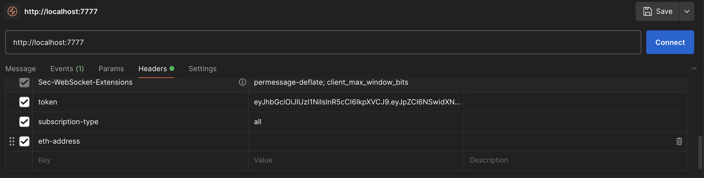
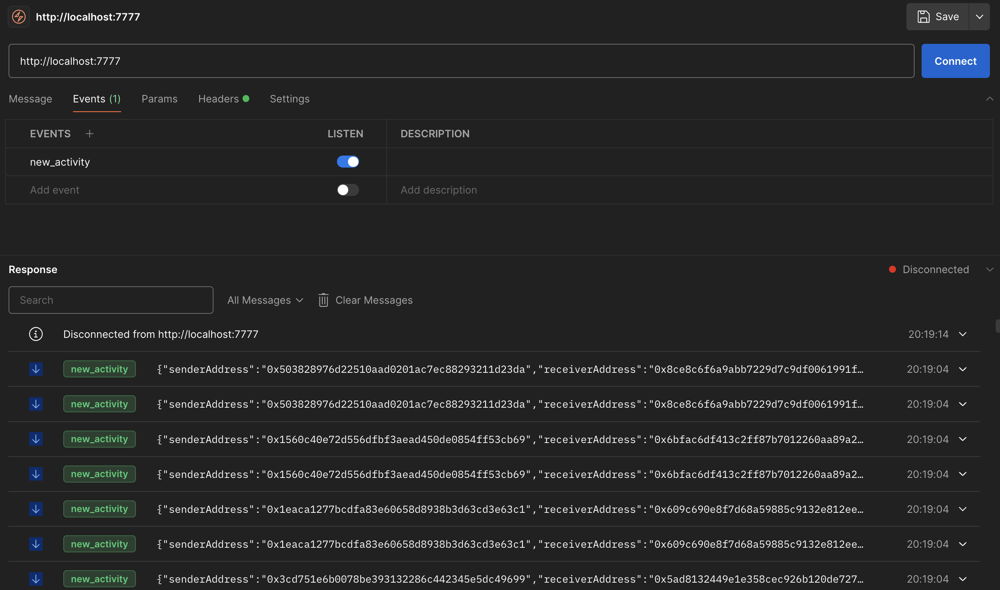

# eth-socket-server

An api that pulls data from ethereum and publishes to all listeners via socket.io.

## tech stack

- Node.js
- TypeScript
- TypeORM
- PostgreSQL
- SocketIO
- Express
- TypeDI

## startup

Create a .env file from the .env.example file and ensure all values are present.

```sh
cp .env.example .env
```

Run Docker Compose to spin up api and db

```sh
docker-compose up
```

## endpoints

A jwt is required to access the websocket endpoint. To get this, first register a user and then login to get the token.

- Register:

POST `http://localhost:$PORT/api/v1/users`

```json
{
  "username": "username",
  "password": "password"
}
```

- Login:

POST `http://localhost:$PORT/api/v1/users/login`

```json
{
  "username": "username",
  "password": "password"
}
```

- SocketIO

http://localhost:$PORT

The socketIO component requires the following headers: token, subscription-type and eth-address. subscription-type can be one of `all | sender_only | receiver_only | sender_or_receiver`. When it is `all`, eth-address will be ignored.



To start receiving events via postman, you will need to listen to the `new_activity` event like so:


